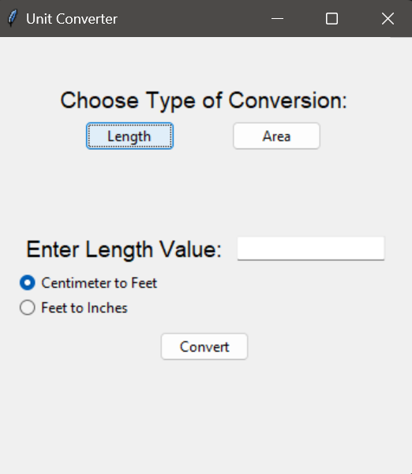
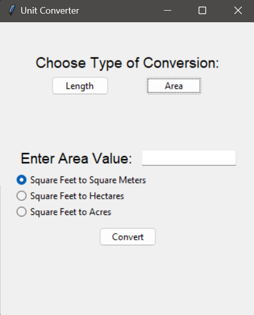

# Unit Converter

This is a simple unit converter GUI application built using Tkinter in Python. It allows conversion between lengths and areas with various units.

## Features
- Conversion between lengths and areas
- Length conversions supported: Centimeter to Feet, Feet to Inches
- Area conversions supported: Square Feet to Square Meters, Square Feet to Hectares, Square Feet to Acres

## How to Use
1. Run the script.
2. Choose the type of conversion: Length or Area.
3. Enter the value you want to convert.
4. Select the conversion type.
5. Click on the "Convert" button.
6. The result will be displayed below.

## Screenshots

## Dependencies
- Python 3.x
- Tkinter

## Running the Application
1. Clone the repository or download the script.
2. Ensure you have Python and Tkinter installed.
3. Run the script using `python filename.py` command.

## Credits
This script is created by mueez.

Feel free to contribute to this project or suggest improvements. If you encounter any issues, please report them in the issues section.
